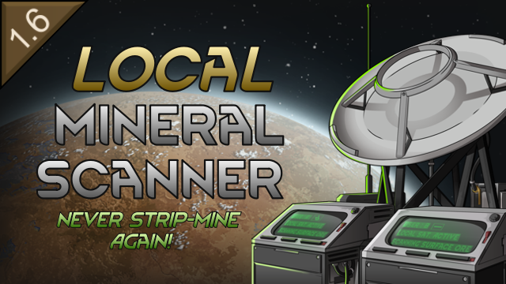

# Local Mineral Scanner

> A RimWorld mod adding a compact local mineral scanner that reveals undiscovered deposits on the current map

## About

Never strip-mine again. Vanilla RimWorld hides most of a map's ore inside the mountains, and the only ways to get at it are to tunnel blindly or to fetch it from another tile with the long-range mineral scanner. This mod adds the missing middle option: a pawn-operated 2×2 building that scans the map you are already on and unfogs the deposits map generation actually placed there.

- **Reveals real ore** — each successful scan unfogs one contiguous deposit of the tuned mineral; nothing is conjured
- **Tunable** — pick the mineral you want, exactly like the long-range mineral scanner
- **Two operators** — twin consoles let two pawns scan at once, each contributing their full research speed

## Features

### The Scanner

- **Real deposits only**: each find unfogs one contiguous deposit that map generation placed. Fully hidden deposits are found first; partially exposed ones are the fallback
- **Tunable target**: gold, silver, steel, plasteel, components, uranium or jade. A newly built scanner starts on gold, or on the most valuable mineral still hidden on the map if there is no gold
- **Two operators**: two pawns can scan simultaneously, each contributing their full research speed — a genuine second seat, not queueing
- **Same effort per find** as the vanilla long-range mineral scanner, with results limited to the current map

### Knows When It's Done

- **Pauses when exhausted**: when no undiscovered deposits of the tuned mineral remain, the scanner stops consuming pawn labor and keeps its progress
- **Says so everywhere**: the find that reveals the last deposit says so in a message, the inspect pane explains why the scanner is idle, and the tuning menu greys out exhausted minerals

### Placement & Progression

- **Minifiable**: uninstall it and take it along on mining trips or to a new map
- **No new research**: unlocked by the vanilla long-range mineral scanner research

### Mod Settings

- **Roof rule**: let it be placed and operated under a roof
- **Uninstalling**: make it a fixed installation instead
- **Scan times**: the random find interval and the guaranteed-find time
- **Cost and mass**: steel, component and advanced component counts, and the uninstalled weight
- All settings take effect as soon as the window closes, no restart needed

## Requirements

- **RimWorld 1.6** or later
- No DLC required
- No Harmony or other mod dependencies

## Installation

### Steam Workshop (Recommended)

Coming with the first release.

### Manual Installation

1. Download the latest release from the [Releases](https://github.com/sam-hunt/LocalMineralScanner/releases) page
2. Extract the `LocalMineralScanner` folder to your RimWorld `Mods` directory:
   - **Windows**: `C:\Program Files (x86)\Steam\steamapps\common\RimWorld\Mods\`
   - **Mac**: `~/Library/Application Support/Steam/steamapps/common/RimWorld/RimWorldMac.app/Mods/`
   - **Linux**: `~/.steam/steam/steamapps/common/RimWorld/Mods/`
3. Enable the mod in RimWorld's mod menu
4. Restart RimWorld

## Compatibility

- **Safe to add** to existing saves.
- **Not safe to remove** from saves (built scanners and the per-map scan bookkeeping would be orphaned).

## Contributing

Bug reports and feature requests welcome on [GitHub Issues](https://github.com/sam-hunt/LocalMineralScanner/issues).
Please attach any relevant logs/stack traces/mod lists etc.

Translations are welcome — see [CONTRIBUTING.md](CONTRIBUTING.md).
For development setup, see [CLAUDE.md](CLAUDE.md).

## Credits

**Author**: Sam Hunt ([@sam-hunt](https://github.com/sam-hunt))

**Special Thanks**:

- Scanner art by [IcingWithCheeseCake](https://steamcommunity.com/profiles/76561198094174176/myworkshopfiles/?appid=294100)
- [Ludeon Studios](https://ludeon.com) for RimWorld and modding API
- [The RimWorld modding community](https://steamcommunity.com/app/294100/workshop/) for inspiration
